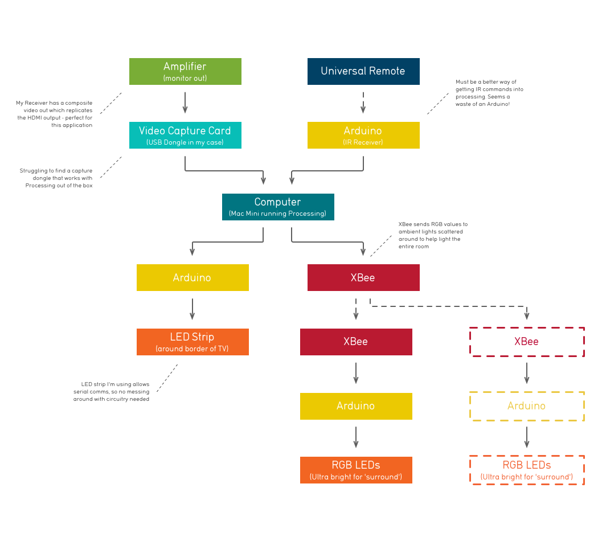

# Live Lights

My custom, work-in-progress implementation of [Ambilight](https://www.google.com/search?tbm=isch&q=ambilight).

Unlike many other implementations, this project doesn't rely on XMBC or video playing through a computers media player (although does require a computer to parse and process data).

## Flow

The application flows as such:
